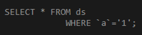

# C# @ 的使用方法

本篇主要介紹 @ 特殊字元，方便使用者對字串進行所需要的操作以及關鍵字識別項的使用，其使用方法主要有以下三種方式：

### 1. 逐字解釋字元
在字串前面加上 @ 就是告訴編譯器，接下來的字串由使用者全權負責
在沒有 @ 以前，字串中的 \ 符號代表跳脫字元，因此，在寫路徑的字串就會變得比較麻煩，如下圖 1 所示：
```cs
public static void Main(string[] args) {
	string path = "D:\\Test\\test.txt";
	Console.WriteLine(path);  // D:\Test\test.txt
}
```
圖 1、字串路徑

再加上 `@` 之後，如下圖 2 所示：
```cs
public static void Main(string[] args) {
	string path = @"D:\Test\test.txt";
	Console.WriteLine(path);  // D:\Test\test.txt
}
```
圖 2、使用 @ 在路徑字串前綴

### 2. 直接換行
在沒有 @ 之前要使用 “+” 進行字串串接，寫起來不只比較繁瑣，程式碼閱讀上也會比較不方便，如下圖 3 所示：
```cs
public static void Main(string[] args) {
	string command = "SELECT * FROM xx"
	      + " WHERE `a` = '1';";
	Console.WriteLine(command);  // SELECT * FROM xx WHERE `a` = '1';
}
```
圖 3、”+” 串接字串

字串前綴 @ 開啟換行功能，如下圖 4、5所示：
```cs
public static void Main(string[] args) {
	string command = @"SELECT * FROM
	xx WHERE `a` = '1';";

	Console.WriteLine(command);
}
```
圖 4、字串換行



圖 5、換行結果

### 3. 關鍵字作為變數名稱
當需要使用 C# 關鍵字當作識別碼的時候使用，使用方法如下圖6所示：
```cs
public static void Main(string[] args) {
	var @static = "static";
	var @int = "100";
}
```
圖 6、關鍵字作為變數名稱宣告