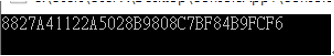

# C# MD5 加密字串
MD5 (message-digest algorithm 5) ，具有很好的安全性，因為具有不可逆的特性 (也就是加密過後是無法進行解密的)，加密過後密文經過解密後和加密之前相同的可能性極小)，並且發生碰撞的機率很低。

MD5 白話來說就是一種演算法，可以將字串、文件或是壓縮檔等項目，執行 MD5 後，產生一個「固定長度」為 128 bit 的雜湊值，目的是要讓大量訊息再使用數位簽章軟體簽屬私人密鑰之前被壓縮成一種保密的格式。

所以，有人修改過之後，就會產生新的雜湊值，此時就可以拿原本提供的雜湊值和新產生的雜湊值進行比較，如果有不同，那就是有被修改過了。

基於上述想到 MD5 的用法有以下兩種：
1.	使用雜湊演算法加密後，將這些雜湊值放到資料庫或檔案中，如果這些加密後的值外流了，這個演算法便可以作為最後的保密手段。
2.	另外如上面有提到的，可以做為檔案是否有被修改的手段。

在 C# 中使用 MD5 很簡單，先將字串轉換為 byte 陣列，再將此陣列丟入到MD5 函式中，即可取得雜湊值，如下圖 1 所示：

```cs
class Program {
	static void Main(string[] args) {
		var temp = "ABCDEF";

		MD5 md5 = MD5.Create();

		// 將字串轉為 utf-8 的位元組陣列
		var utf8 = Encoding.UTF8.GetBytes(temp);

		// 取得 hash code
		var hash = md5.ComputeHash(utf8);

		// 將 byte 陣列轉換為對應的 16 進位字串表示
		var encode = BitConverter.ToString(hash).Replcae("-", string.Empty);

		Console.WriteLine(encode);

		Console.Read();
	}
}
```

輸出結果如下圖 2所示：



圖 2、MD5 雜湊值