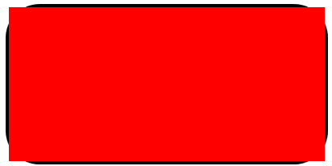
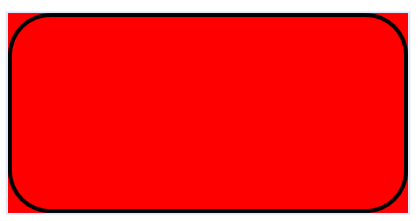
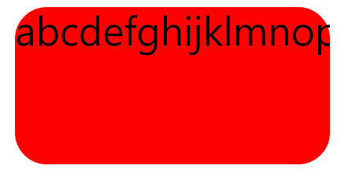
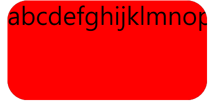

# WPF 使用 OpacityMask 製作圓弧容器

通常我們想要讓 WPF 的容器具有圓弧的外型，往往調出來的結果就會是，裡面的內容物超出外層容器的樣子；為了解決此問題，本篇主要介紹如何透過 `OpacityMask` 的方式，來解決上述的問題。

首先，來看一般的做法，這邊會介紹原本的三種圓弧邊界的作法，最後在介紹使用 `OpacityMask` 的方法。

### 作法一：使用 Border 包覆內部元素
下面的寫法，會導致包在 Border 裡面的項目大小，只要超過 Border 的話，就會直接超出去，如下圖 1 所示：
```xml
<Grid Width="100" Height="50">
    <Border CornerRadius="10" BorderBrush="Black" BorderThickness="1">
        <Grid>
            <Rectangle Fill="Red">
        </Grid>
</Grid>
```



圖 1、Border 直接包含元素

### 作法二、在元素的外面，使用 Border 去覆蓋
這次是在與內層元素同一階層的部分，在下方使用 Border 將邊界框出來，但是結果還是會發生超出邊界的狀況，結果如下圖 2 所示：
```xml
<Grid Width="100" Height="50">
    <Grid>
        <Rectangle Fill="Red">
    </Grid>
    <Border CornerRadius="10" BorderBrush="Black" BorderThickness="1"/>
</Grid>
```


圖 2、外層再使用 Border 覆蓋

### 作法三：OpacityMask
直接使用 Border 當作外部容器，但這樣會有一個問題，只要裡面的元素長一點的話，內容物還是會超出，如下圖 3 中的 p 字，會超出一點點。
```xml
<Border BorderBrush="Black" CornerRadius="10" Background="Red" Width="100" Height="50">
    <TextBlock Text="abcdefghijklmnopqrstuvwxyz">
</Border>
```


圖 3、直接使用 Border 包含元素

再來就是要介紹本次的主角，`OpacityMask` 的方式，內容物即使有比較長，他還是會讓內容物被外層完美的包覆在容器中，不會讓他超出去。

```xml
<Grid Width="100" Height="50">
    <Border x:Name="mask" Background="Black" CornerRadius="10"/>
    <Grid>
        <Grid.OpacityMask>
            <VisualBrush Visual="{Binding ElementName=mask}"/>
        </Grid.OpacityMask>

        <Rectangle Fill="Red"/>
				<TextBlock Text="abcdefghijklmnopqrstuvwxyz"/>
    </Grid>
</Grid>
```


圖 4、使用 OpacityMask