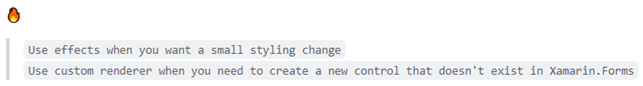
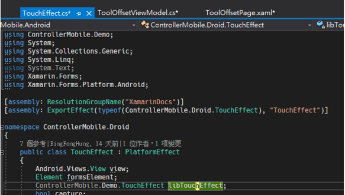
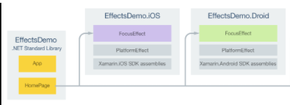
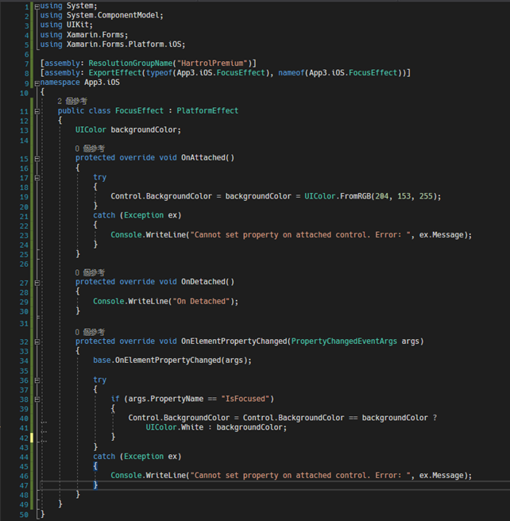
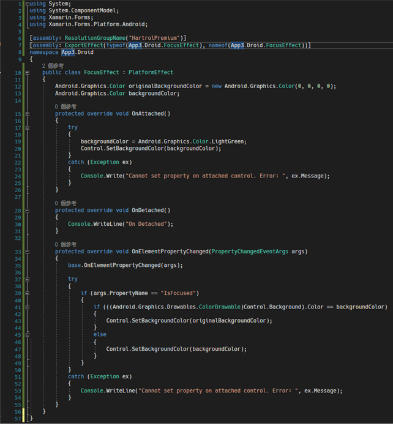
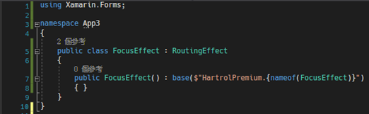
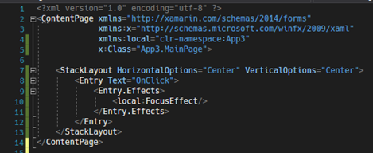
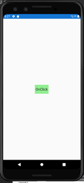
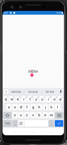

# Xamarin.Forms Effects

Xamarin.Forms 使用者介面會使用目標平台 (Android/iOS) 原生的控制項外觀來呈現，讓 Xamarin.Forms 應用程式能夠為每個平台保留原生的外觀。

但是，有時我們必須要自行設計外觀，來達到我們想要的視覺效果，為此 Xamarin.Forms 有兩種方式，可以改變控制項的外觀，CustomRenderer 與 Effect。

先來說說這兩種最主要的差別，
Custom Renderer：Xamarin.Forms 為 Pages、Layout 與 Controls 提供了一個共用的 API，來分別針對不同平台時，使用各平台的外觀。其主要是使用 Renderer 類別，來決定現在是什麼平台，要用什麼平台外觀呈現以及具預備甚麼行為。

因此，使用者可以繼承控制項 Renderer 的方式，來去客製化，但是，這對於要簡單的客製化來說，可能會有點太過多。可以使用更簡單的 Effect 的方式，簡單的修改控制項，使用此方法，可以快速地達到所需的需求。

以下是網路上找到的建議

為此，本篇主要討論 Effect 如何簡單修改控制項外觀。

在每個指定平台的專案中 (Xamarin.Android/Xamarin.iOS)，建立效果的流程如下：
1.	建立一個繼承 PlatformEffect 的子類別
2.	覆寫 OnAttached 方法，並且撰寫邏輯來自定義控制項
3.	覆寫 OnDetached 方法，並且撰寫邏輯來清除自定義控制項
4.	加入 ResolutionGroupName Attribute。該屬性為效果設定一個公司範圍的命名空間，用來防止與其它具有同名稱的效果發生出同。 (這個屬性在每個專案中，只可設定一次)
5.	加入 ExportEffect Attribute 到效果類別，這個屬性註冊一個獨立的 ID 給 Effect，以便在效果應用到控制項之前，定位效果這個屬性需要兩個參數，效果的類別名稱以及一個唯一的字串) 類似再套用效果到控制項之前，先決定效果要套用到哪個控制項上面。

基本的程式碼如下圖 1 所示：

圖1、針對平台建立指定效果

下面範例將實作一個 Focus 的效果，當控制項取得焦點時，改變控制項的背景顏色。下圖2，說明每個專案的責任以及他們之間的關係。

圖2、Effect 路由

## iOS 平台實作 FocusEffect
按照剛剛上圖 1 的方式，針對 iOS 實作效果路由，當控制項 IsFocused 時，背景改成白色，當沒有 Focused 時，背景為紫色，程式碼如下圖 3 所示。

圖3、iOS Effect

## Android 平台實作 FocusEffect
針對 Android 實作效果路由，當控制項 IsFocused 時，背景改成白色，當沒有 Focused 時，背景為亮綠色，程式碼如下圖 4 所示。

圖 4、Android Effect

上面各平台中的 OnElementPropertyChanged 覆寫了當 bindable property 改變時，會進行的動作。

現在雙平台各自的效果都做好了，現在就是要在 Xamarin.Forms 中使用，首先在 Xamarin.Forms 定義 FocusEffect 類別，並解繼承 RoutingEffect 類別，如下圖 5 所示。

圖5、Xamarin.Forms 繼承 RoutingEffect

## RoutingEffect
RoutingEffect 類別，是代表平台獨立效果，其中包含特定平台的內部效果。
根據給定的名稱找到 ResolutionGroupName 也就是剛剛的 HartrolPremium 公司名稱，以及指定的獨立 ID (上面是使用類別名稱 FocusEffect) 來找到對應的效果。

因此使用起來就會是像下圖 6 所示：

圖 6、使用 Effect

各平台效果如下所示：

### Android

  
未 Focus/ Focus

### iOS

  
未 Focus/ Focus
