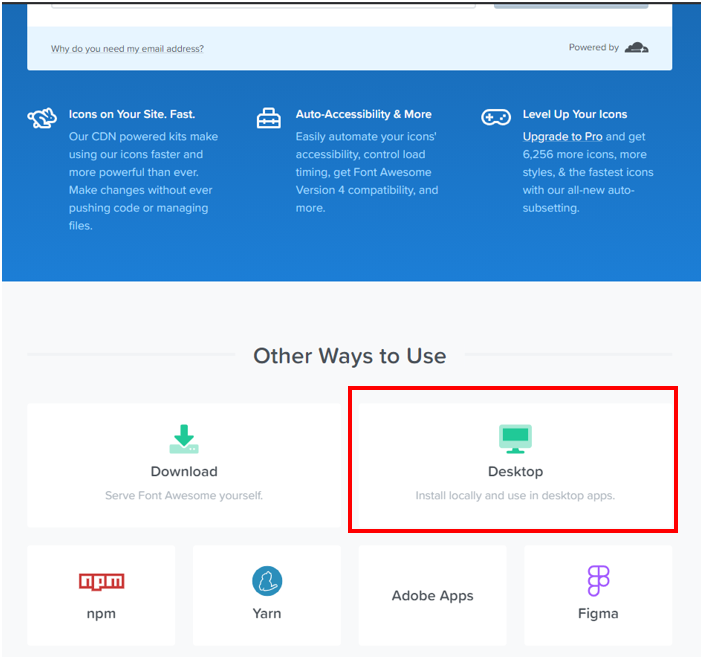
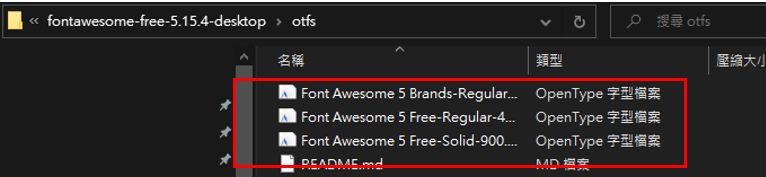
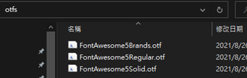
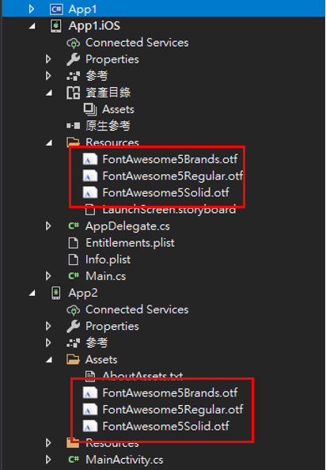
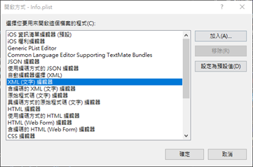
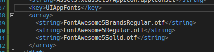
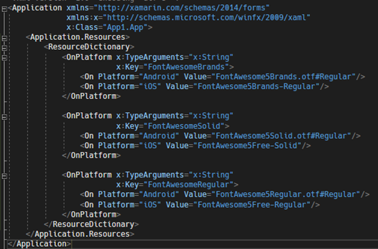
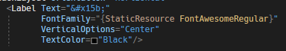
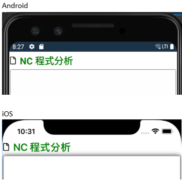

# Xamarin.Forms 使用 FontAwesome
通常設計畫面時，會加入一些 icon 來輔助文字說明，期望透過 icon 就表達意思。為此，本篇將介紹如何在 Xamarin.Forms 中，使用 Font Awesome 這個免費的 icon 圖庫；使用 Font Awesome 的好處是，他是文字，所以在修改顏色或是尺寸都可以按照一班文字的使用形式進行修正，使用起來相當方便。

首先，到 Font Awesome 的官網下載 icon 字形，並點選 Start for Free，如圖 1 所示：

圖 1、Font Awesome 官網首頁

進入下載頁面後，點選 Desktop 下載壓縮檔，如下圖 2 所示：

圖 2、點選 Desktop 下載壓縮檔

壓縮檔下載完成後，解壓縮，並找到裡面的 otfs 資料夾，將使用裡面所有 otf 副檔名的檔案，如下圖 3 所示：

圖 3、取得 otfs 的解壓縮資料夾

將檔案重新命名一下，去除掉一些空白並減少一些文字，如下圖 4 所示：

圖 4、重新命名檔案

開啟 Xamarin.Forms 專案，將檔案分別加入至對應的手機平台專案底下，如下圖 5 所示：

- Android 專案：將檔案放至 Assets 資料夾，並且將改變 Build Action 為 AndroidAsset
- iOS 專案：將檔案放置 Resources 資料夾，並且改變 Build Action 為 BundleResource

圖 5、加入至指定平台專案下

這邊 iOS 平台要在另外處理 Info.plist 檔案，對此檔案點右鍵選擇 **開啟方式**，然後使用 XML (文字) 編輯器，如下圖 6 所示：

圖 6、使用 XML 編輯器

在底下加入以下字串，如下圖 7 所示：

圖 7、Info.plist 加入指定字串

加入完成之後，再到 Xamarin.Forms 的 App.xaml 檔案中，將這些 icon 的資源引入，如下圖 8 所示：

圖 8、App.xaml 引入 icon 資源

之後，就可以在 Xamarin.Forms 的專案中，以以下格式 &#xf15b; 的形式，並且指定 FontFamily，將 icon 字型顯示出來，如下圖 9 所示：

圖 9、加入 FontFamily

就可以在各自的平台上看到指定的 icon 了，如下圖 10 所示。

圖 10、各自平台 icon 呈現

Font Awesome 官網：https://fontawesome.com/