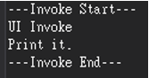
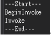
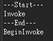
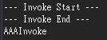
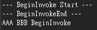

# C# BeginInvoke vs Invoke
如果當程式是在 UI 執行緒上進行比較大量的運算時，會導致畫面卡住，等到運算完成之後，畫面才可繼續執行，但是這是一個不良的設計。執行續可以幫助我們將一些演算過程較繁瑣的功能，放到背景執行緒中，等執行完成之後再通知我們進行操作。但在UI 執行緒與背景跨執行續的過程中，通常會碰到 BeginInvoke 與 Invoke 兩種跨執行續的方法，往往會搞不清楚到底該呼叫哪一個；為此，本篇主要介紹這兩種調用執行續的方法，解決在使用執行續過程中導致不如預期的結果。

Invoke 與 BeginInvoke 的區別在於，Invoke 會阻塞當前的執行續，直到 Invoke 執行結束，才會繼續執行下去，而 BeginInvoke 則可以非同步的執行，以下將分為幾個情形進行 BeginInvoke 與 Inovke 的詳細探討。

### 1. 主執行續呼叫 Invoke
在主執行緒 Invoke 呼叫之後，是立即執行 Invoke 裡面的程式碼的，如下圖 1 所示：

```cs
private void UIInvoke() {
	Console.WriteLine("--- Invoke Start ---");
	uiThread.Invoke(new Action(() => {
		SpinWait.SpinUntil(() => false, 1000);
		Console.WriteLine("UI Invoke");
	}));

	Console.WriteLine("Print it.");
	Console.WriteLine("--- Invoke End ---");
}
```


圖1、主執行緒呼叫 Invoke

### 2. 主執行緒呼叫 BeginInvoke
可看到當調用 BeginInvoke 的執行緒結束之後，才會執行 BeginInvoke 內的內容。

```cs
private void UIBeginInvoke() {
	Console.WriteLine("--- BeginInvoke Start ---");
	uiThread.BeginInvoke(new Action(() => {
		Console.WriteLine("UI BeginInvoke");
	}));

	SpinWait.SpinUntil(() => false, 1000);
	Console.WriteLine("Print it.");
	Console.WriteLine("--- BeginInvoke End ---");
}
```


圖 2、主執行續呼叫 BeginInvoke

### 3. 主執行緒中先呼叫 BeginInvoke 在呼叫 Invoke
但是有例外狀況，如果在同一個主執行緒中，同時調用 Invoke 與 BeginInvoke 的話，如果 BeginInvoke 順序是在 Invoke 之前，那會馬上執行 BeginInvoke，如下圖 3 所示：

```cs
private void UIBeginInvokeBeforeInvoke() {
	Console.WriteLine("--- Start ---");

	uiThread.BeginInvoke(new Action(() => {
		SpinWait.SpinUntil(() => false, 1000);
		Console.WriteLine("BeginInvoke");
	}));

	uiThread.Invoke(new Action(() => {
		SpinWait.SpinUntil(() => false, 1000);
		Console.WriteLine("Invoke");
	}));

	Console.WriteLine("--- End ---");
}
```


圖3、主執行緒中先呼叫 BeginInvoke 在呼叫 Invoke

### 4. 主執行緒中先呼叫 Invoke 在呼叫 BeginInvoke
如果 Invoke 是在 BeginInvoke 之前那就會變成與前面(2)一樣，等待呼叫的主執行續執行完成，才會執行 BeginInvoke，如下圖 4 所示：

```cs
private void UIBeginInvokeAfterInvoke() {
	Console.WriteLine("--- Start ---");

	uiThread.Invoke(new Action(() => {
		SpinWait.SpinUntil(() => false, 1000);
		Console.WriteLine("Invoke");
	}));

	uiThread.BeginInvoke(new Action(() => {
		SpinWait.SpinUntil(() => false, 500);
		Console.WriteLine("BeginInvoke");
	}));

	Console.WriteLine("--- End ---");
}
```



圖 4、主執行緒中先呼叫 Invoke 在呼叫 BeginInvoke  

### 5. 副執行緒調用 Invoke
在副執行緒中調用 Invoke 不只會阻塞主執行緒，也會阻塞副執行緒，如下圖所示5，可以看到 Invoke 還會阻塞副執行緒(因為沒有出現 BBB)：
```cs
private void BackgroundUIThreadInvoke() {
	Console.WriteLine("--- Invoke Start ---");

	Task.Factory.StartNew(() => {
		string temp = "AAA";

		uiThread.Invoke(new Action(() => {
			Console.WriteLine(temp += "Invoke");
		}));

		SpinWait.SpinUntil(() => false, 1000);

		temp += " BBB";
	});

	Console.WriteLine("--- Invoke End ---");
}
```


圖 5、副執行緒調用 Invoke


### 6. 副執行緒調用 BeginInvoke
BeginInvoke 在副執行緒中也會阻塞主執行緒，但是相對於副執行緒來說是非同步的，因為 BBB 有先顯示出來，如下圖 6 所示：

```cs
private void BackgroundUIThreadBeginInovke() {
	Console.WriteLine("--- BeginInvoke Start ---");

	Task.Factory.StartNew(() => {
		string temp = "AAA";
		uiThread.BeginInvoke(new Action(() => {
			SpinWait.SpinUntil(() => false, 1000);
			Console.WriteLine(temp += " BeginInvoke");
		}));

		SpinWait.SpinUntil(() => false, 50);

		temp += " BBB";
	});

	Console.WriteLine("--- BeginInvokeEnd ---");
}
```


圖 6、副執行緒中調用 BeginInvoke

由上可知由於 Invoke 與 BeginInvoke 是屬於 UI 的執行緒，因此在執行上會都會阻塞主執行緒，但是Invoke 的話還會阻塞副執行緒，而 BeginInvoke 來說則不會。
從主執行續執行 BeginInvoke 的話，立即執行裡面的內容，阻塞了主執行緒，而在副執行續執行 BeginInvoke 的話，則不像 Invoke 在副執行緒中，當執行到 Invoke 時，因跑到 UI 執行緒了，卡住後面副執行緒的操作。
