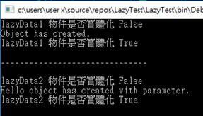

# C# Lazy 延遲物件實例化
Lazy 主要的功能是，讓程式中的物件在需要時再進行實體化，那這樣有什麼好處呢? 這樣可以解省寶貴的系統資源，例如當建立一個物件時，所要花費的系統資源開銷很大，但是這個物件在系統地執行時，不一定會被使用到，此時就可以使用延遲物件實體化的方式，從而使程式占用更少的內存。

從下面的範例可以看到物件的實體化是在實際需要用到時，在使用 Lazy.Value的屬性再將它實體化出來。

```cs
class TestData {
	public string Temp;

	public TestData() { }

	public TestData(string param) {
		Temp = param;
	}

	public void Test() {
		if (string.IsNullOrEmpty(Temp)) {
			Console.WriteLine("Object has created.")
		} else {
			Console.WriteLine($"{Temp} object has created with parameters");
		}
	}
}

class Program {
	static void Main(string[] args) {
		// 無引數的建構子
		Lazy<TestData> lazyData1 = new Lazy<TestData>();
		Console.WriteLine($"lazyData1 物件是否實例化 {lazyData1.IsValiueCreated}");

		// 使用 Lazy 的 Value 實體化物件
		lazyData1.Value.Test();
		Console.WriteLine($"lazyData1 物件是否實例化 {lzayData1.IsValueCreated}");
		Console.WriteLine("-----------------------------------");

		// 有引數的建構子
		Lazy<TestData> lazyData2 = new Lazy<TestData>(() => new TestData("Hello"));
		Console.WriteLine($"lazyData2 物件是否實體化 {lazyData2.IsValueCreated}");

		// 使用 Lazy 的 Value 實體化物件
		lazyData2.Value.Test();
		Console.WriteLine($"lazyData2 物件是否實體化 {lazyData2.IsValueCreated}");
	}
}
```

