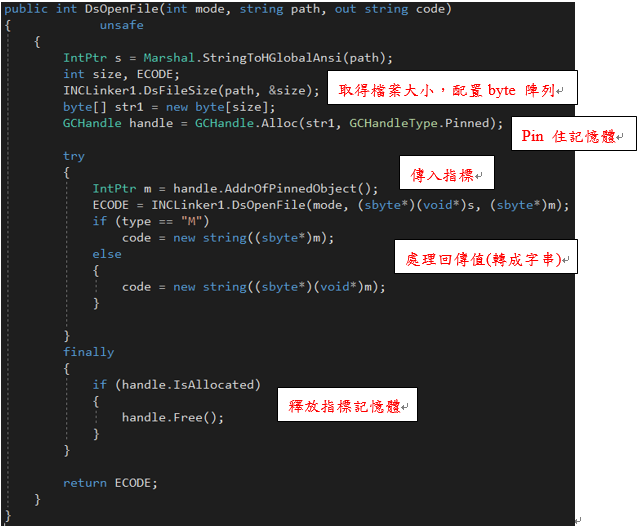
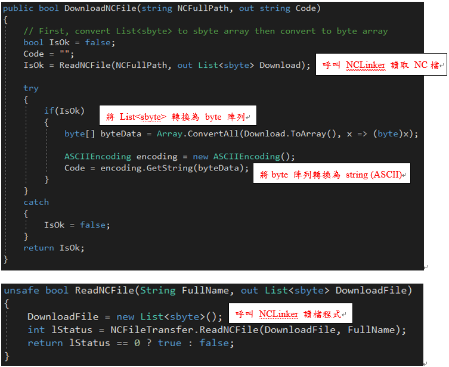

# C# sbyte 陣列轉換為 string
最近在撰寫NCLinker檔案傳輸發現一個蠻方便的東西，在這邊分享給大家。大家都知道三菱函式庫是使用 C++ 開發的，因此我們要呼叫使用他的函式庫必須使用 C++ 做呼叫，但是我們平常所開發的軟體是使用C#，所以還有一個將C++轉換成C#的中介類別，方便直接就可以用C# 呼叫函式，但是在將 VC++ 資料拿回來時，通常都需要做一些處理 C# 與 VC++ 之間才有辦法共享資料，本篇主要想要介紹其中一個檔案傳輸會使用到的方法，將 VC++ 那端所得到的 sbyte 轉換成 C# 的 string。

首先先介紹之前NCLinker 的作法是，首先要下載控制器端的 NC檔時，必須先在 C# 先知道這個檔案的大小，再使用這個大小建立出一個 byte型別陣列的記憶體空間，然會因為我們會怕這個C# 記憶體空間在呼叫 VC++ 函式的時候會被釋放，我們必須先將這個記憶體先Pin住，再透過指標的方式將該記憶體空間傳到 VC++ 中，VC++ 跟控制器要完檔案後，再將得到結果指標轉成字串，轉換完畢之後還要將之前所寫的指標釋放，總之這個步驟很繁瑣，程式碼如下：



由於上面還牽扯到 Managed Code 轉換成 Unmanaged Code 所以程式碼會有些麻煩，嘗試另外一種寫法，發現呼叫三菱後回傳給 VC++ 的資料型別與C# 的資料型別 sbyte 大小一致，所以我們就可以直接拿來使用不用再做轉換，再來因為資料是一長串的資料，所以之前的做法是先取得檔案大小在配置合適的陣列大小，在將值塞入陣列中，但是因為陣列的話又會扯到 C# 轉換成指標的問題。

後來發現，原來 VC++ 的System::Collections::Generic;中的List 與 C# 在使用的 List 可以共用，所以只要在 VC++ 在呼叫引數的地方使用指標去承接C# List 的記憶體，而後在VC++中將值塞入陣列中，函式完成執行後，C# 那端就可以得到經過VC++塞完值的 List ，因為是拿到一個 sbyte 的 List，那我們要怎麼從List<sbyte>轉成字串呢? 接下來就是本篇的重點了。

```cs
sbyte[] sbyteData = new sbyte[]{ 77, 78, 21, 22, 23, 24 }

// Convert sbyte[] to byte[]
byte[] byteData = Array.ConvertAll(sbyte, x => (byte)x);

ASCIIEncoding encoding = new ASCIIEncoding();

string code = encoding.GetString(byteData)
```

參考上面的範例，因為我們的編碼規則是 ASCII，所以我們建立一個 ASCII 的編碼器，但是他只能將 byte 型別陣列轉成字串，所以我們首先要處理的就是將 List<sbyte> 轉換成 byte 陣列，轉換成byte 陣列之後我們就可以用編碼器，之後我們就可以使用 byte 轉換成字串了。

