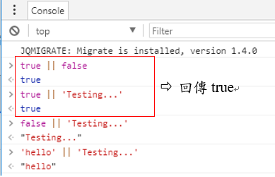

# JavaScript 建立函式預設值

本篇將介紹一些基本的 JavaScript 概念，為往後深入 JavaScript 打下基礎，為此本篇將以函式預設值為出發點，慢慢導入到 JavaScript 的基本核心。

首先建立一個函式名稱，取名為 Test，然後呼叫他時，可以傳入一個參數；當呼叫函式時，會印出傳入參數，如下所式：
```js
function Test(name) {
	console.log(`${name} Testing...`)
}

Test("My")  // My Testing...
```

呼叫方法會回傳 `My Testing...` 的字串，那麼問題來了，當並未傳入參數時，結果會如何呢?

如下所示，可看到結果顯示出來為 `undefined Testing...`

```js
function Test(name) {
	console.log(`${name} Testing...`)
}

Test()  // undefined Testing...
```

為什麼會這樣呢? 這是因為程式在執行的過程中，根據 JavaScript Hoisting 的觀念 (下面做說明)，變數已經被建立在函式裡面了 (被提升到最上方)，只是還沒有給值，如果說變數建立後還沒有設定值之前，該變數都會設定為undefined的值，因此在name的部分會是undefined，然後因為自動轉型 (coercion)的緣故，undefined在輸出之前就會先被自動轉型成string，因此才有辦法與後面的字串做相結合。

那麼回應標題，我們要如何建立預設值的函數，我們只需要新增一列指令就能達到預設值的效果了。

```js
function Test(name) {
	name = name || '<Enter your name here!>';
	console.log(name + ' Testing...');
}

Test();
```

可以發現結果會顯示 <Enter your name here!> Testing…
我們下面先做一些簡單的測試，測試完畢後，就可以知道為甚麼這樣就可以為函式設定預設值了。



我們可以發現，當左邊為true時，他就會直接回傳true，可是當左邊是false時，換判斷右邊，當右邊是字串時，會判斷為true並且回傳字串，因為JavaScript有這樣的特性，所以我們可以讓函式有預設值。

**Hoisting (提升)**：

在JavaScript中，變數的範圍概念不為區域變數的概念，而是語彙範疇 (lexical scope) ，這表示函式執行時的變數範疇是函式定義時生效的範疇，而非調用時的變數範疇。

請看以下範例：
```js
var test = function() {
	console.log(Hoisting);  // undefined

	if (1) {
		var Hoisting = 'local';
	}

	console.log(Hoisting);  // local
}
```
從上面的範例可以看到，在函式內的變數宣告會被提升到函式的最上方，但是變數配值的部分並不會提升到最上方，因此，在這個函式內，Hoisting變數雖然被宣告在if的區域變數裡面，但是變數的宣告還是會被提升到最前面，所以當我把Hoisting印出來的時候，他會是undefined，並不會編譯錯誤(not defined)，當進入if 區域變數裡面配完值之後，印出來就會是有配值的狀態 (輸出：local)，這就是JavaScript的Hoist觀念了。

**Coercion (型別轉換)**

JavaScript有一個特別的地方，就是如果有兩個不同的型別在計算時，JavaScript會去自動地做型別結合的動作，因此我們常常可以看到，數字型別 + 字串型別時，JavaScript會自動地去轉換成字串型別，如下範例： console.log(1 + "3"); // => 13

因為有這樣的特性所以在本篇中，可以透過這樣的方式讓函式有預設值的效果。
