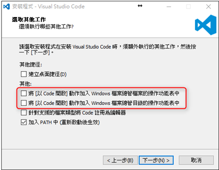
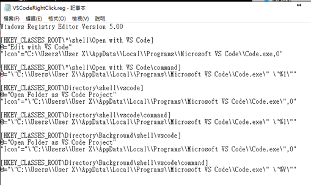

# Visual Studio Code 右鍵開啟程式設定
在安裝 Visual Studio Code 的時候，有兩個選項是詢問，是否要將開啟 VS Code 加入到右鍵選單中，

如果沒有勾選的話，按右鍵是不會有開啟 VS Code 的選項的，碰到這種情形，我們不用重裝，只要加入一下 Windows 註冊檔就可以了。

建立一個文字檔，將以下內容貼到文字檔中。

然後將檔名命名成，VSCodeRightClick.reg，然後同意執行之後，就可以在右鍵選單中看到 VS Code 了。