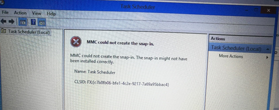
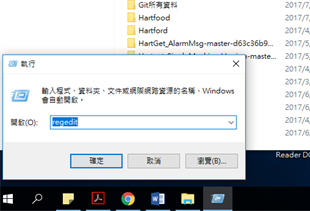
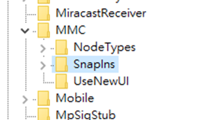
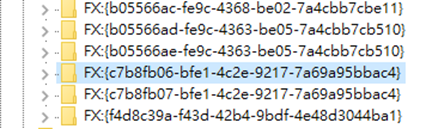

# 工作排程出現 MMC 解決辦法
使用工作排程時，打開出現如下圖 1 的錯誤，導致工作排除無法成功開啟一些相關的預設背景執行的作業，此問題只要簡單的幾個步驟即可解決。

圖 1、MMC could not create the snap-in error

首先，我們進入regedit，如下圖2，進入後，找到HKEY_LOCAL_MACHINE\SOFTWARE\Microsoft\MMC\Snap-in，並且在裡面找到如圖 4 所顯示的問題點檔案後，我們將此檔案做個匯出備份一下此檔案的動作以免操作錯誤，備份好之後，將此registry key刪除，之後將電腦重新啟動，你的工作管理員就回來了。

圖 2、進入 regedit

圖 3、SnapIns 資料夾

圖 4、找出 MMC 的問題點