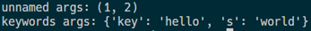

# Python 函式基本教學
本篇將介紹 Python 函式的建立，透過函式建立的方式可以縮減大量重複程式碼的問題，讓程式看起來可讀性更高更具備結構化的特性；此外，將說明一些常用的函式的使用方式。

**函式定義**  

函式 (Function) 建立可重複呼叫使用的程式區塊，具有三個特性函式名稱、參數輸入與參數輸出功能。在 Python 中會先以 def 作為函式定義的開頭，如下圖 1 所示：

```py
# function 定義
def my_first_function(val):
	print(val)
	return None

# 呼叫 function
my_first_function(1)
```
圖 1、function 建立

:fire:切記，Python 是以縮排當作程式區塊，因此要注意程式縮排的規則

從上面的 function 中可以看到 val 代表的是輸入的參數，return 是代表輸出函數，
  - Function 如果不需要輸入任何的參數就不用寫變數名稱
  - Function 如果沒有輸出函數的需要是可以不用寫 return。

**一級函式**

Python 的函數與 JavaScript 一樣屬於一級函式。一級函式的意思是我們可以將函式指定給某個變數、將函式傳入另一個函式或是從函式中回傳一個函式，如同使用一般的物件操作一樣去操作函式，聽起來很複雜，實際看看下圖的程式碼，如下圖2所示：

```py
def my_wrapper(func):
	func(10)

my_wrapper(my_first_function)
```
圖 2、傳入函式到另一個函式中

上圖可以看到，我將剛剛第一次寫的 my_first_function 當作參數傳給新的 function ，並且在新的 function 中傳入一個 10 的參數進行呼叫，呼叫結果可以在畫面中看到是顯示 10。

接下來示範如何在函式中回傳一個函式，如下圖3所示：
```py
def tool():
	def add(val1, val2):
		return val1 + val2

	return add

add_value = tool()

print(add_value(1, 2))
```
圖3、回傳一個函式

**匿名函式**

匿名函式是指一個無須定義識別符號 (函式名稱) 的函式，匿名函式的優點是可以省去定義函式的過程，讓程式碼可以更加精簡，如下圖4所示：
```py
func = lambda x: x * 2

print(func(10))
```
圖4、匿名函式

**函式參數預設值**

當函式輸入時，在沒給定輸入參數的情況下，想要使用預設值可以使用一下方式決定函式的參數預設值，如下圖5所示：
```py
def my_second_function(val = 20):
	print(val)

my_second_function()
```

圖5、參數預設值

**args 與 kwargs**

當我們希望函式參數可以接受任意參數時，可使用 args (無名稱參數組成的 tuple) 以及 kwargs (無名稱參數組成的字典)，如下圖6與圖7所示：
```py
def my_third_function(*arg, **kwargs):
	print('unnamed args:', arg)
	print('keywords args:', kwargs)

my_third_function(1, 2, key='hello', s = 'word')
```
圖6、args 與 kwargs 定義


圖7、函式呼叫結果
